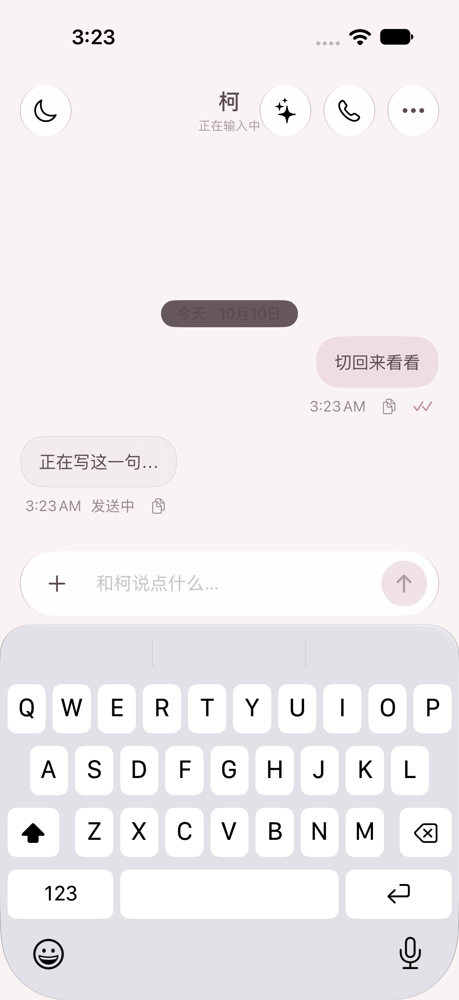
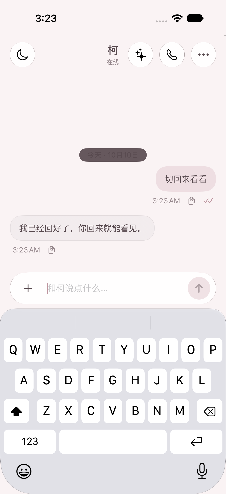

# 82 版：切回前台立即接回回复

交给 Claude 核对后上架。此分支不修改服务器、不重启服务、不上传安装页。

## 基线与修复范围

- 基线：已上架的 81 版分支 `codex/notes-tray-tarot-build81`，提交 `8c4801501cc89a526ee7e4defd04d2a8255f111c`。
- 本分支：`codex/foreground-recovery-build82`；[PR #6](https://github.com/jia01226/ios-client/pull/6)。
- 原问题：App 从后台回来时，把仍占着 `activeStreamClientID` 的旧 SSE 当成正常连接，跳过恢复，等到超时后才查询已完成的回复。
- 现在进入后台，或 inactive 超过 2 秒后回到 active，会先废弃旧连接的所有权、取消旧任务，再直接查询已知 job 与历史。已完成的 job 不在 active 列表里，因此优先查具体 job，避免漏掉完成的回复。
- 每轮连接使用独立 UUID 所有权。旧 SSE、旧 job 查询、历史查询、补发回执的迟到事件或错误都要核验所有权，不能覆盖新结果、清掉新连接或弹假失败。
- 收到完整历史前，先用服务器消息 ID 对齐本地半截回复，避免留下重复气泡。Thinking 的既有显示和本地保留逻辑继续使用。
- 没收到回执就切出的消息，沿用原 `client_msg_id` 和原内容／附件接回。回复途中继续发的消息也保留原键与回执队列。
- 点通知进入时选择「柯」，并调用同一恢复入口；冷启动时通知意图保留到视图挂载。
- 打开 App／读取聊天时清图标角标，不批量删除已送达的用药等通知。
- 81 版抽屉、便利贴、日记、塔罗、下棋、经期、排班、单聊天窗口、Thinking 和运动权限保留。工单里双弈 nginx 403 已由 Claude 处理，本版不改后端。

## 交付包与验收

最终候选提交：`c0dee0fa12e40694e08cf2d44a31193afec2ebdf`。

- [打包 38020010965](https://github.com/jia01226/ios-client/actions/runs/38020010965)：成功。artifact 为 `KeApp-ipa`，内含 `柯.ipa`。
- 实查包内版本 `0.1.0 (82)`，Bundle ID `love.jiagude.ke`，大小 66,386,318 bytes。
- SHA-256：`51b3a0ec53639ee6168139c0b7793a6737f5899807133aa725eb8fc7f8bf9516`。
- 下载后解包验签：`codesign --verify --deep --strict` 通过；Team `527CR3MRV2`；APNs `production`；`get-task-allow = false`。
- [模拟器 38020009145](https://github.com/jia01226/ios-client/actions/runs/38020009145)：成功，97 项单测与完整 UI 验收通过；其中 10 项专门覆盖此次恢复逻辑。
- 只交付上述 run 和 SHA 对应的 IPA；早期候选 run `38018621517`、`38019036197` 均不交付。后续提交只补文档及截图，不改变该源码提交的 App／测试代码。
- 清角标使用独立任务；系统通知服务的回调不能阻止完整回复结束「正在输入中」状态。模拟器同时检查完整回复和顶部恢复在线。

## 亲眼验过 / 没验过

| 亲眼验过 | 没验过 |
| --- | --- |
| 已直接查看本轮原生模拟器截图：切出前是半截回复；切回后完整回复替换半截气泡，没有重复或假错误，顶部恢复「在线」。 | 佳佳 iPhone 14 Pro Max 的真机恢复速度、真实 APNs 通知点击和生产网络下的端到端时延。 |
| 本轮 iPhone 18 Pro／iOS 27.0 模拟器，App 内计时从收到 active 到完整回复气泡出现为 **0.0776 秒**，两秒门槛通过。计时使用固定模拟服务器，不能当作生产网络耗时承诺。 | 真机弱网、蜂窝与 Wi-Fi 切换、系统杀进程之后的恢复；通知角标在真实设备上的最终表现。 |
| 下载并解包最终 IPA，核对版本号、Bundle ID、大小、SHA-256、签名与 production 推送签名权限。 | 安装页尚未由本任务上架，也未在真实手机安装。 |

自动化记录还包括：正常流式不中断、短暂 inactive 保留连接、长 inactive 和后台恢复、点通知与激活接近同时到达、旧轮询迟到的未授权错误、新连接不被旧任务清理、丢失回执沿用原 client ID 与内容、回复途中补发、冷启动、手动刷新替换旧轮询。现有「我们」、月历、日记翻页／选日期、抽屉白天夜间、便利贴、塔罗和下棋 UI 回归一并通过。

### 本轮截图

| 切到后台前 | 切回前台后 |
| --- | --- |
|  |  |

[App 内计时原始附件](screenshots/build82/recovery-timing.txt)。完整截图与 xcresult 见上述模拟器 run 的 `iOSSimulator-screenshots`、`iOSSimulator-xcresult` artifacts（GitHub 保存 14 天）。截图右上角极小的数字仅为 DEBUG 验收计时，Release IPA 不含此测试标记，也不含模拟回复。

## Claude 真机验收

1. 安装 82，向柯发一句，立即回桌面。等服务器完成后，重新打开 App；检查是否在 1–2 秒内显示完整回复。
2. 重复上述过程，这次点真实 APNs 通知进入；包括原来停在「我们／玩／柯的」时也能回到聊天。
3. 完成后继续等超过原先 30 秒超时窗口：不出现「回复中断」、重复气泡或已完成回复被半截覆盖。
4. 不切后台正常聊天；柯回复途中继续发两条，再切出／切回；确认发送正常、消息不重复。
5. 检查打开／读完后图标角标清零。保留运动权限，核对用药提醒仍按既有逻辑工作。
6. 真机弱网、蜂窝／Wi-Fi 切换和 App 被系统终止后的冷启动另行核验；客户端取消旧连接不代表停止服务器正在生成的任务。

仅核对通过后由 Claude 上架；用户继续走原网页安装。后续新修改从本分支或 Claude 合并后的分支继续，Build ≥83，避免再撞号。
