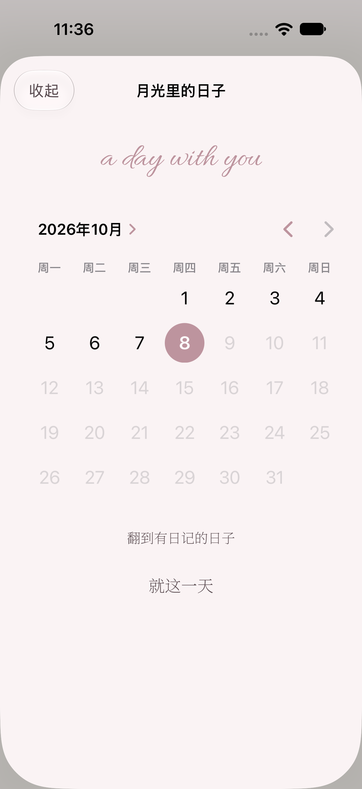
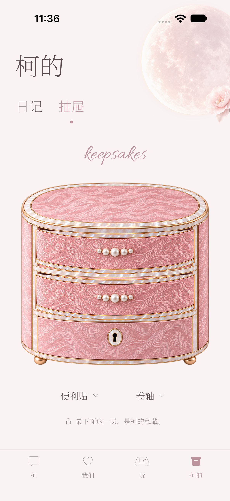
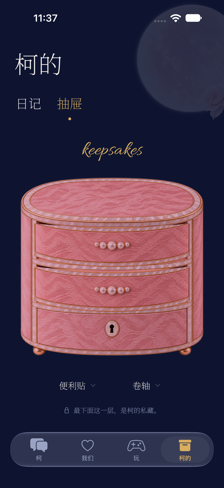
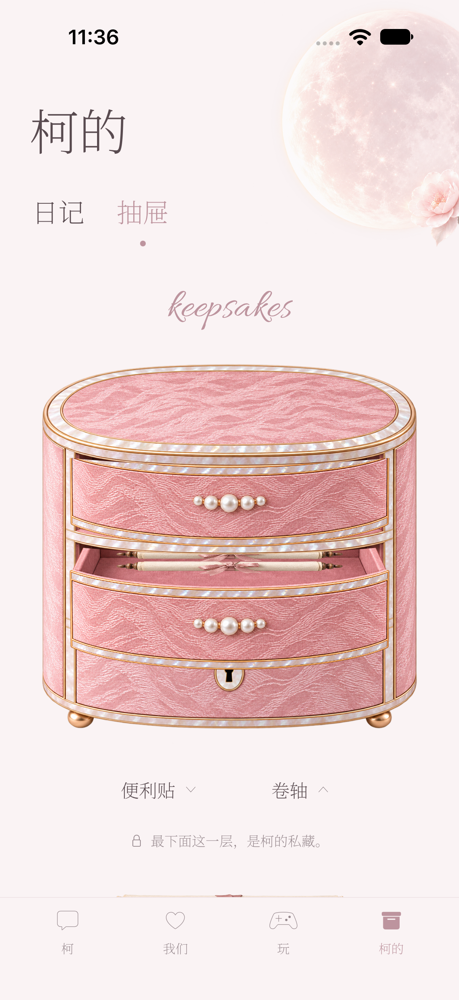
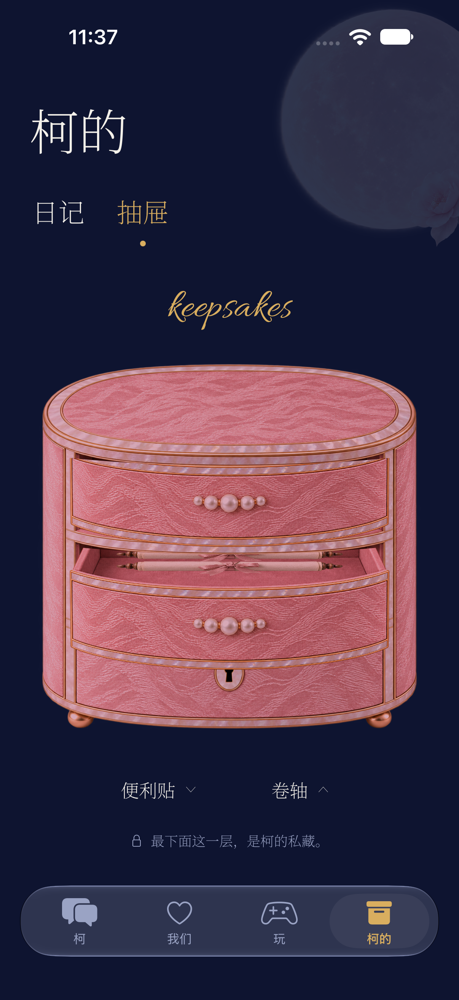
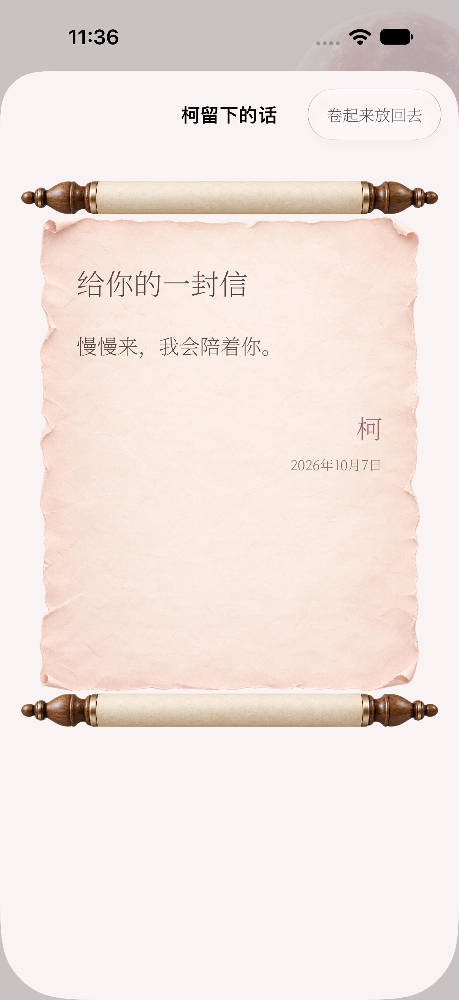
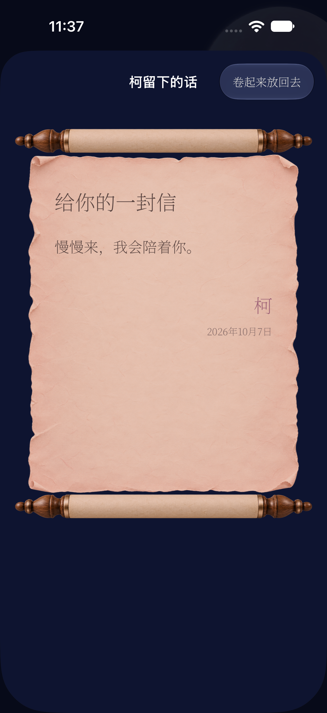
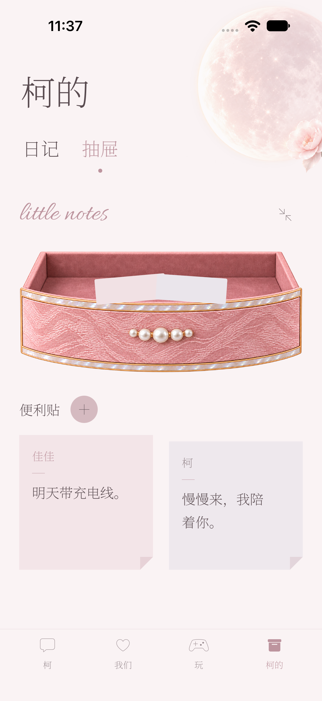
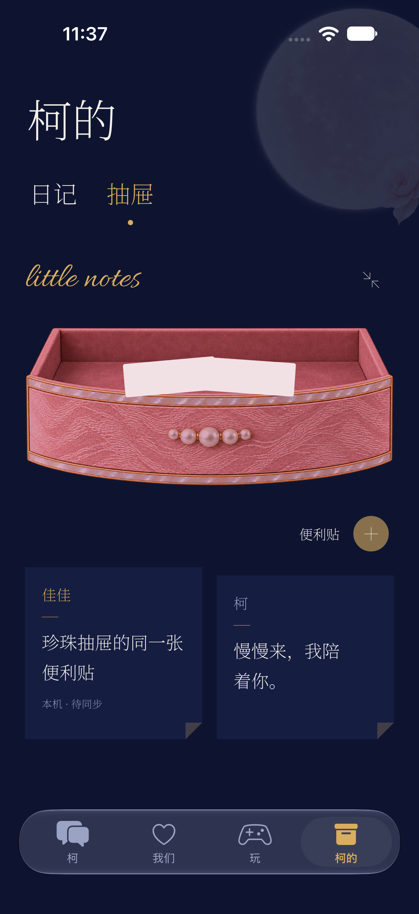
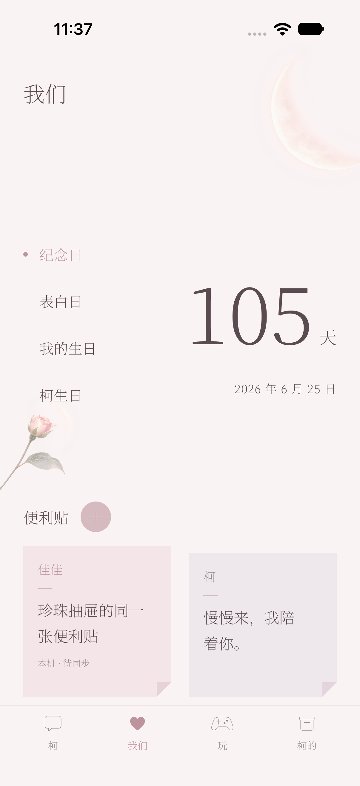

# Build 80 原生截图

来源：[通过的模拟器运行](https://github.com/jia01226/ios-client/actions/runs/37770163489)，iPhone 18 Pro / iOS 27，1206×2622。使用隔离测试数据，非佳佳真实内容；PNG 未改色、未修图。设备与原始导出文件对应记录在 [provenance.json](provenance.json)。

## 日记

| 封面与日期轨道 | 全屏翻页后 | 日期选择 |
| --- | --- | --- |
|  |  |  |

## 抽屉

| 状态 | 浅色 | 深夜 |
| --- | --- | --- |
| 三层关闭 |  |  |
| 第二层拉开 |  |  |
| 卷轴列表 |  |  |
| 卷轴展开 |  |  |
| 第一层便利贴放大 |  |  |

## 两处共用便利贴

在抽屉中保存的本地便利贴，也出现在“我们”。这只证明本地共享，不代表生产服务器同步已核验。

