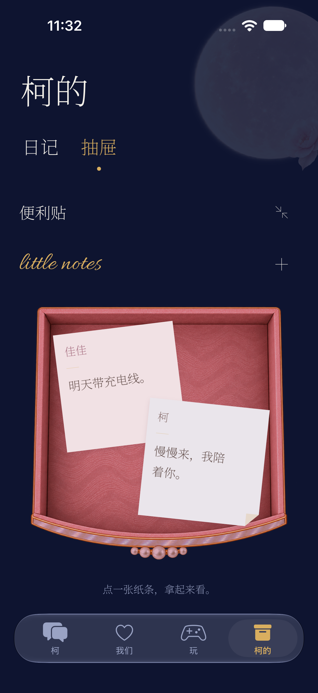
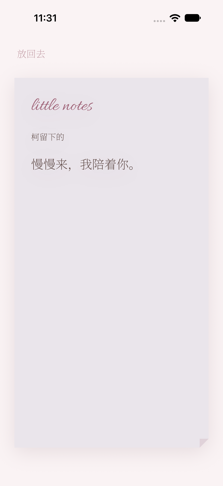
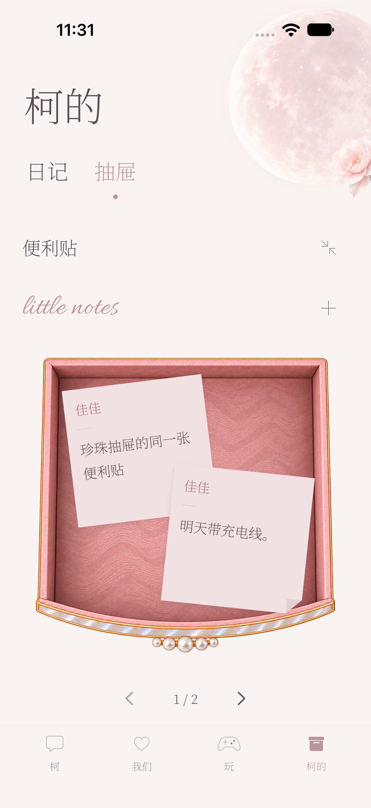
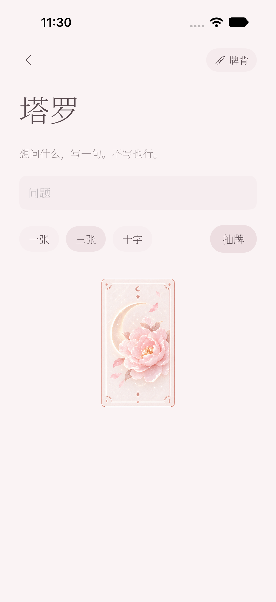
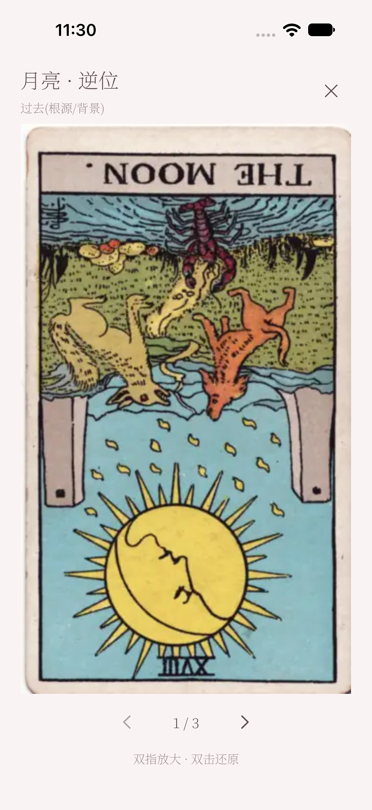
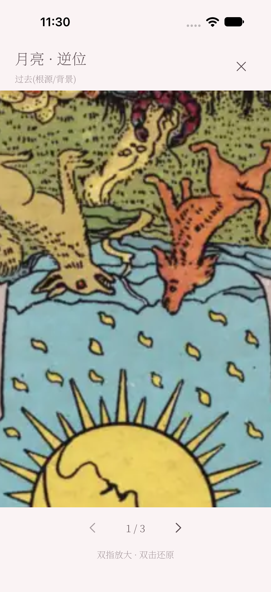
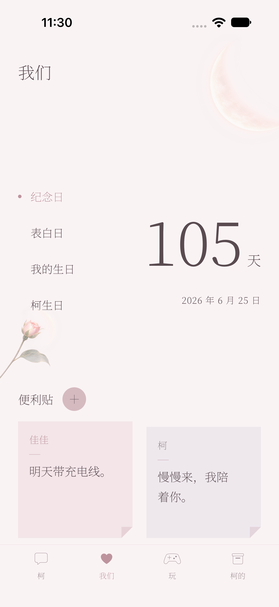

# Build 81 · 原生模拟器截图

来源：[成功的 UI 核验](https://github.com/jia01226/ios-client/actions/runs/37859119077)，源码 `af3a07d760921298eea93c840b37338641511433`。

iPhone 18 Pro / iOS 27.0，隔离测试数据。这里都是 xcresult 原始截图，没有拼图、裁切或补画，未在 14 Pro Max 真机验收。完整附件名、设备与时间见 [provenance.json](provenance.json)。

`01-chat.png` 拍摄时有系统运动权限提示遮挡，不是完整聊天外观验收。双弈截图为模拟导航失败，不能证明线上游戏可用。

## 便利贴俯视／错落摆放

## 深夜同一抽屉

## 拿起一张纸条

## 新增后仍在抽屉中

## 我们显示同一张纸条

## 柜子关着

## 卷轴抽屉俯视（可滚动）

## 展开信纸

## 深夜信纸

## 月光山茶牌背

## 逆位牌面全屏

## 牌面双指放大

## 日记封面

## 翻到下一页

## 日记选日

## 双弈加载失败提示

## 我们

## 月历

## 玩

